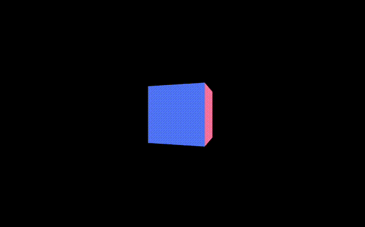
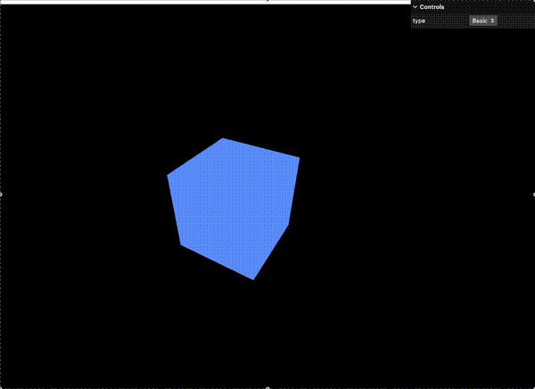
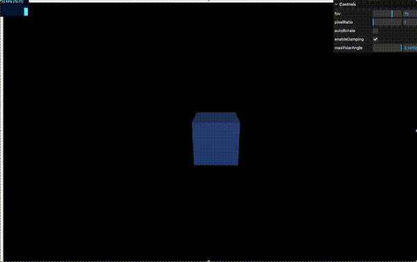
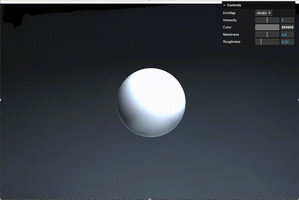
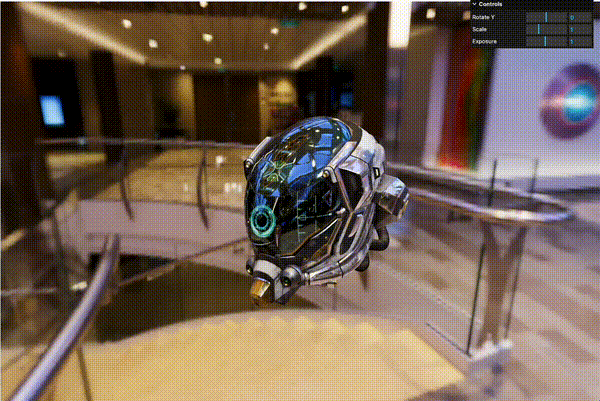

# threejs-snipet

学習ログ兼スニペット置き場 — three.js を「写経 → 改造 → 空書き」で手に馴染ませるためのレポジトリです。  
⭐️ 役立ったら Star をぜひ！

## 環境構築

```zsh
# clone
git clone https://github.com/<your‑repo>/threejs-snipet.git
cd threejs-snipet

# install
arch -arm64 pnpm install   # Apple‑Silicon / zsh

# dev server
pnpm dev                   # http://localhost:5173
```

| ツール | バージョン例 | 用途 |
| --- | --- | --- |
| Node | ≥ 18 | ランタイム |
| pnpm | 9.x | パッケージマネージャ |
| Vite | 5.x | Bundler / Dev server |
| TypeScript | 5.x | 型付き JS |
| three.js | r157 | 3D ライブラリ |
| lil‑gui | 0.19 | パラメータ GUI |
| stats.js | 0.17 | FPS パネル |

> **ARM Mac** では `arch -arm64` を付けて Rosetta を回避。

## Features

- **Zero‑Config Starter** – Vite + TypeScript + pnpm で即開発開始  
- **Hands‑On Demos** – Geometry / Material / Camera / Renderer を GUI でリアルタイム操作  
- **PBR Ready** – MeshStandard・PhysicalMaterial、HDRI 環境マップをすぐ試せる構成  
- **Apple‑Silicon Optimised** – `arch -arm64 pnpm` ひと声でネイティブ実行  
- **Clean Git History** – 各デモをフォルダ単位でコミット、追跡しやすい

---

## Project Structure (抜粋)

```text
src/
  demos/
    002_handwrite_cube/
    003_geometry_gui/
    004_material_compare/
    005_camera_renderer/
  lib/                ← 共通ユーティリティ予定
vite.config.ts
```

## 2025‑04‑18 Day 3

### 002 Hand‑write Cube  


### 003 Geometry + GUI  


### 004 Material Compare  


### 005 Camera & Renderer  


### 006 Envmap Variations 


### 007 Instanced Benchmark 


### 008 GLTF Loader 



---

## Assets & Thanks

All demo assets — models, HDRIs, textures, etc. — are taken from libraries that release their work under **CC0 / Public-Domain** terms.  
Attribution isn’t legally required, but huge thanks to every creator and organization who shares their assets freely. Your generosity makes open-source graphics possible! 🙏